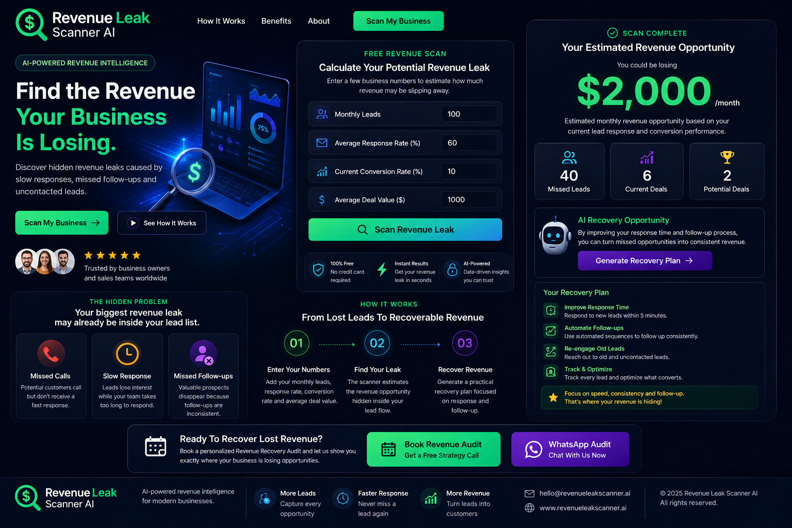

 ⚡ Revenue Leak Scanner AI

Find Hidden Revenue. Recover Lost Leads. Grow Faster.

AI-powered Revenue Intelligence & Lead Recovery Platform

""Live Demo" (https://img.shields.io/badge/🚀_Live_Demo-Revenue_Leak_Scanner-00E6B8?style=for-the-badge)" (https://mk906036875-create.github.io/revenue-leak-scanner-ai/)
""Version" (https://img.shields.io/badge/Version-Premium-blueviolet?style=for-the-badge)" (#)
""Platform" (https://img.shields.io/badge/Platform-GitHub_Pages-black?style=for-the-badge)" (#)
""Technology" (https://img.shields.io/badge/Built_With-HTML%20%7C%20CSS%20%7C%20JavaScript-orange?style=for-the-badge)" (#)

---

🖼️ Product Preview

<strong>Premium AI Revenue Intelligence Interface</strong>

---

🚀 Live Demo

«Try the scanner → discover the revenue opportunity → generate a recovery plan.»

---

💡 What Is Revenue Leak Scanner AI?

Revenue Leak Scanner AI is a premium business intelligence demo designed to help businesses identify potential revenue opportunities hidden inside their existing lead pipeline.

Many businesses continuously spend money generating new leads while losing revenue from:

- Missed calls
- Slow responses
- Uncontacted leads
- Inconsistent follow-ups
- Poor lead prioritization
- Weak CRM processes

Revenue Leak Scanner approaches the problem differently:

«Before generating more leads, find the revenue you're already losing.»

---

🔍 How It Works

01 — Enter Your Numbers

Provide four basic business metrics:

- Monthly Leads
- Average Response Rate
- Current Conversion Rate
- Average Deal Value

02 — Scan Revenue Leak

The scanner analyzes the inputs and estimates:

- Missed Leads
- Current Deals
- Potential Deals
- Recoverable Revenue Opportunity

03 — Generate Recovery Plan

The system provides practical recommendations focused on:

- Faster response
- Automated follow-ups
- Lead prioritization
- Multi-step follow-up
- CRM tracking

04 — Book Revenue Audit

Businesses can continue from the demo directly to a:

Revenue Recovery Audit

through Email or WhatsApp.

---

📊 Example Scan

Business Metric| Example
Monthly Leads| 100
Response Rate| 60%
Conversion Rate| 10%
Average Deal Value| $1,000

Example Output

Revenue Metric| Estimated Result
Missed Leads| 40
Current Deals| 6
Potential Deals| 2
Revenue Opportunity| $2,000/month

«The scanner provides an estimate based on the entered business metrics and recovery assumptions. It is intended for demonstration and business-planning purposes, not as a guaranteed revenue forecast.»

---

🤖 AI Recovery Plan

After the scan, users can generate a practical recovery strategy.

⚡ Faster Lead Response

Reduce the time between lead submission and first contact.

🔁 Automated Follow-ups

Create consistent follow-up sequences for leads that don't respond.

🎯 Lead Prioritization

Focus sales attention on prospects with higher potential value.

📅 Multi-Step Follow-up

Build structured follow-up workflows instead of relying on one contact attempt.

📊 CRM Tracking

Track every lead from first contact through conversion.

---

🎯 Built For

Revenue Leak Scanner AI is designed for businesses where lead response and follow-up directly impact revenue.

Ideal Users

- 🦷 Dental Clinics
- 🏠 Real Estate Businesses
- 🔧 Home Service Companies
- 📈 Marketing Agencies
- 💼 Sales Teams
- 🚗 Automotive Businesses
- ⚖️ Professional Services
- 🏢 Local Businesses
- 🚀 Startups
- 👨‍💼 Founders & CEOs

---

💰 Business Opportunity

Businesses often ask:

«"How can we generate more leads?"»

Revenue Leak Scanner asks:

«"How much revenue are we already losing from the leads we have?"»

This creates an opportunity to improve revenue without simply increasing advertising spend.

Revenue Recovery Flow

Existing Leads
      ↓
Revenue Leak Scan
      ↓
Identify Missed Opportunities
      ↓
AI Recovery Plan
      ↓
Automated Follow-up
      ↓
More Conversations
      ↓
More Conversions
      ↓
More Revenue

---

🧠 Core Value Proposition

Don't Just Generate More Leads.

Recover The Revenue You're Already Losing.

Revenue Leak Scanner AI turns basic lead metrics into an actionable recovery opportunity.

Scan → Analyze → Recover → Grow

---

🛠️ Technology

Built using modern web technologies:

- HTML5
- CSS3
- JavaScript
- GitHub Pages
- Responsive UI
- Interactive Revenue Scanner
- AI-style Recovery Plan Interface

---

📱 Responsive Design

Designed to work across:

- 📱 Mobile
- 💻 Desktop
- 🖥️ Large Screens
- 📟 Tablets

The interface is optimized for a modern SaaS-style experience.

---

🚀 Project Demo

Live Website

https://mk906036875-create.github.io/revenue-leak-scanner-ai/

---

🎯 Demo Purpose

This project demonstrates how an AI-powered revenue intelligence product could help businesses:

- Identify missed opportunities
- Estimate recoverable revenue
- Prioritize leads
- Improve follow-up systems
- Create recovery strategies
- Increase sales efficiency

---

🔮 Future Improvements

Potential future versions can include:

- AI-powered lead scoring
- CRM integrations
- Automated email follow-ups
- WhatsApp automation
- Lead database
- Real-time analytics
- Revenue forecasting
- Client dashboards
- Stripe payments
- Authentication
- AI API integration
- Automated reporting

---

👨‍💻 Developer

Manish Tiwari

AI Automation & Web Solutions

Building practical digital products for modern businesses.

---

⚡ Find Your Revenue Leak.

🚀 Recover Lost Opportunities.

💰 Grow Your Business.

Revenue Leak Scanner AI

